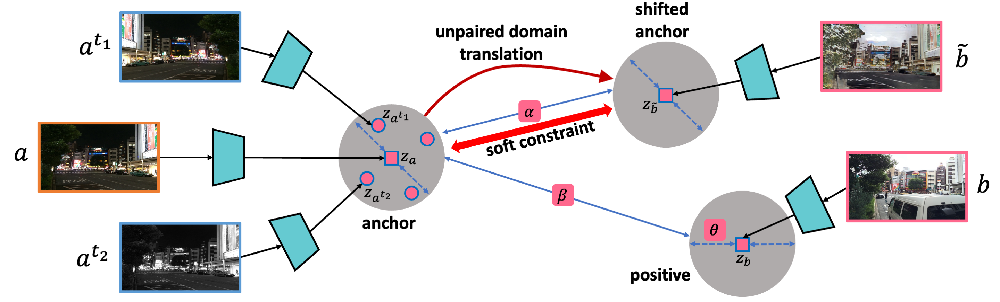
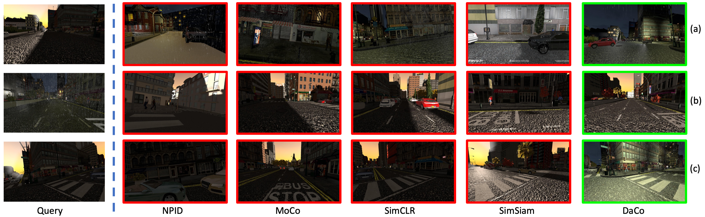
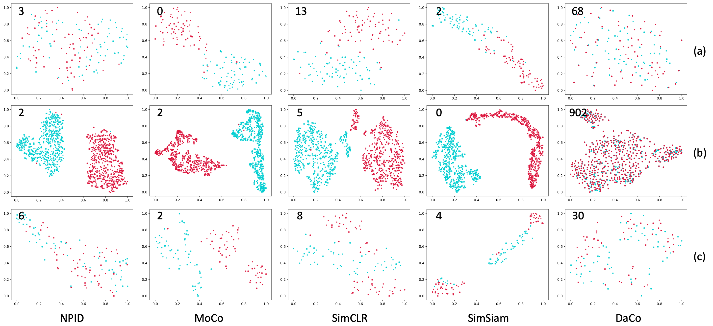

# DaCo

A PyTorch implementation of DaCo based on APIN 2023
paper [DaCo: Domain-Agnostic Contrastive Learning for Visual Place Recognition](https://link.springer.com/article/10.1007/s10489-023-04629-x).



## Requirements

- [Anaconda](https://www.anaconda.com/download/)
- [PyTorch](https://pytorch.org)

```
conda install pytorch=1.7.0 torchvision cudatoolkit=11.0 -c pytorch
```

## Dataset

[Tokyo 24/7](http://www.ok.ctrl.titech.ac.jp/~torii/project/247/),
[Cityscapes FoggyDBF](https://www.cityscapes-dataset.com) and [Synthia Seqs](https://synthia-dataset.net/downloads/)
datasets are used in this repo, you could download these datasets from official websites, or download them from
[MEGA](https://mega.nz/folder/kx53iYoL#u_Zc6ogPokaTRVM6qYn3ZA). The data should be rearranged, please refer the paper to
acquire the details of `train/val` split. The data directory structure is shown as follows:

 ```
├──tokyo
   ├── original (orignal images)
       ├── domain_a (day images)
           ├── train
               ├── day_00001.jpg
               └── ...
           ├── val
               ├── day_00301.jpg
               └── ...
       ├── domain_b (night images)
           ├── train
               ├── night_00001.jpg
               └── ...
           ├── val
               ├── night_00301.jpg
               └── ...
   ├── generated (generated images)
       same structure as original
       ...
├──cityscapes
   same structure as tokyo
   ...
├──synthia
   same structure as tokyo 
   ... 
```

## Usage

```
python main.py --data_name synthia --method_name simclr
optional arguments:
--data_root                   Datasets root path [default value is 'data']
--data_name                   Dataset name [default value is 'tokyo'](choices=['tokyo', 'cityscapes', 'synthia'])
--method_name                 Method name [default value is 'daco'](choices=['daco', simsiam', 'simclr', 'moco', 'npid'])
--hidden_dim                  Hidden feature dim for projection head [default value is 512]
--temperature                 Temperature used in softmax [default value is 0.1]
--batch_size                  Number of images in each mini-batch [default value is 16]
--iters                       Number of bp over the model to train [default value is 10000]
--ranks                       Selected recall [default value is [1, 2, 4, 8]]
--save_root                   Result saved root path [default value is 'result']
--lamda                       Lambda used for the weight of soft constrain [default value is 0.8]
--negs                        Negative sample number [default value is 4096]
--momentum                    Momentum used for the update of memory bank or shadow model [default value is 0.5]
```

For example, to train `moco` on `cityscapes`:

```
python main.py --data_name cityscapes --method_name moco --batch_size 32 --momentum 0.999
```

to train `npid` on `tokyo`:

```
python main.py --data_name tokyo --method_name npid --batch_size 64 --momentum 0.5
```

## Benchmarks

The models are trained on one NVIDIA GTX TITAN (12G) GPU. `Adam` is used to optimize the model, `lr` is `1e-3`
and `weight decay` is `1e-6`. `batch size` is `16` for `daco`, `32` for `simsiam`, `simclr` and `moco`, `64` for `npid`.
`momentum` is `0.999` for `moco`, `0.5` for `npid`, other hyper-parameters are the default values.

### Tokyo 24/7
<table>
<thead>
  <tr>
    <th rowspan="2">Method</th>
    <th colspan="4">Day --&gt; Night</th>
    <th colspan="4">Night --&gt; Day</th>
    <th colspan="4">Day &lt;--&gt; Night</th>
    <th rowspan="2">Download</th>
  </tr>
  <tr>
    <td align="center">R@1</td>
    <td align="center">R@2</td>
    <td align="center">R@4</td>
    <td align="center">R@8</td>
    <td align="center">R@1</td>
    <td align="center">R@2</td>
    <td align="center">R@4</td>
    <td align="center">R@8</td>
    <td align="center">R@1</td>
    <td align="center">R@2</td>
    <td align="center">R@4</td>
    <td align="center">R@8</td>
  </tr>
</thead>
<tbody>
  <tr>
    <td align="center">NPID</td>
    <td align="center">6.67</td>
    <td align="center">10.67</td>
    <td align="center">17.33</td>
    <td align="center">28.00</td>
    <td align="center">8.00</td>
    <td align="center">12.00</td>
    <td align="center">16.00</td>
    <td align="center">21.33</td>
    <td align="center">2.00</td>
    <td align="center">4.00</td>
    <td align="center">5.33</td>
    <td align="center">10.67</td>
    <td align="center"><a href="https://pan.baidu.com/s/1Y9shBKadeBhkifopHexioA">r2bg</a></td>
  </tr>
  <tr>
    <td align="center">MoCo</td>
    <td align="center">5.33</td>
    <td align="center">6.67</td>
    <td align="center">12.00</td>
    <td align="center">17.33</td>
    <td align="center">6.67</td>
    <td align="center">9.33</td>
    <td align="center">12.00</td>
    <td align="center">16.00</td>
    <td align="center">0.00</td>
    <td align="center">0.00</td>
    <td align="center">0.00</td>
    <td align="center">0.67</td>
    <td align="center"><a href="https://pan.baidu.com/s/1fiTNcm0HV29SExI6ASykPQ">f2jt</a></td>
  </tr>
  <tr>
    <td align="center">SimCLR</td>
    <td align="center">25.33</td>
    <td align="center">32.00</td>
    <td align="center">45.33</td>
    <td align="center">56.00</td>
    <td align="center">33.33</td>
    <td align="center">37.33</td>
    <td align="center">46.67</td>
    <td align="center">58.67</td>
    <td align="center">8.67</td>
    <td align="center">9.33</td>
    <td align="center">14.00</td>
    <td align="center">18.67</td>
    <td align="center"><a href="https://pan.baidu.com/s/1yZhkba1EU79LwqgizDzTUA">agdw</a></td>
  </tr>
  <tr>
    <td align="center">SimSiam</td>
    <td align="center">4.00</td>
    <td align="center">5.33</td>
    <td align="center">9.33</td>
    <td align="center">16.00</td>
    <td align="center">4.00</td>
    <td align="center">5.33</td>
    <td align="center">6.67</td>
    <td align="center">14.67</td>
    <td align="center">1.33</td>
    <td align="center">1.33</td>
    <td align="center">1.33</td>
    <td align="center">3.33</td>
    <td align="center"><a href="https://pan.baidu.com/s/1EG0Rm-gkqTviFcR8qBcHlQ">d2i4</a></td>
  </tr>
  <tr>
    <td align="center">DaCo</td>
    <td align="center"><b>61.33</b></td>
    <td align="center"><b>68.00</b></td>
    <td align="center"><b>78.67</b></td>
    <td align="center"><b>84.00</b></td>
    <td align="center"><b>60.00</b></td>
    <td align="center"><b>70.67</b></td>
    <td align="center"><b>81.33</b></td>
    <td align="center"><b>88.00</b></td>
    <td align="center"><b>45.33</b></td>
    <td align="center"><b>56.67</b></td>
    <td align="center"><b>64.00</b></td>
    <td align="center"><b>74.67</b></td>
    <td align="center"><a href="https://pan.baidu.com/s/139IHtS2_tOZcEK2Qgt-yQw">5dzs</a></td>
  </tr>
</tbody>
</table>

### Foggy Cityscapes

<table>
<thead>
  <tr>
    <th rowspan="2">Method</th>
    <th colspan="4">Clear --&gt; Foggy</th>
    <th colspan="4">Foggy --&gt; Clear</th>
    <th colspan="4">Clear &lt;--&gt; Foggy</th>
    <th rowspan="2">Download</th>
  </tr>
  <tr>
    <td align="center">R@1</td>
    <td align="center">R@2</td>
    <td align="center">R@4</td>
    <td align="center">R@8</td>
    <td align="center">R@1</td>
    <td align="center">R@2</td>
    <td align="center">R@4</td>
    <td align="center">R@8</td>
    <td align="center">R@1</td>
    <td align="center">R@2</td>
    <td align="center">R@4</td>
    <td align="center">R@8</td>
  </tr>
</thead>
<tbody>
  <tr>
    <td align="center">NPID</td>
    <td align="center">5.60</td>
    <td align="center">7.80</td>
    <td align="center">10.20</td>
    <td align="center">17.20</td>
    <td align="center">5.20</td>
    <td align="center">8.40</td>
    <td align="center">12.60</td>
    <td align="center">19.80</td>
    <td align="center">0.20</td>
    <td align="center">0.50</td>
    <td align="center">0.70</td>
    <td align="center">1.00</td>
    <td align="center"><a href="https://pan.baidu.com/s/1oUbOqWIJaJbtUDqcqmklgw">bbiv</a></td>
  </tr>
  <tr>
    <td align="center">MoCo</td>
    <td align="center">0.40</td>
    <td align="center">0.80</td>
    <td align="center">1.40</td>
    <td align="center">3.00</td>
    <td align="center">0.40</td>
    <td align="center">0.80</td>
    <td align="center">1.80</td>
    <td align="center">3.40</td>
    <td align="center">0.20</td>
    <td align="center">0.20</td>
    <td align="center">0.20</td>
    <td align="center">0.20</td>
    <td align="center"><a href="https://pan.baidu.com/s/1iR0_2kL9wq44mKM_-sfr_w">ma2a</a></td>
  </tr>
  <tr>
    <td align="center">SimCLR</td>
    <td align="center">34.60</td>
    <td align="center">48.00</td>
    <td align="center">59.60</td>
    <td align="center">71.40</td>
    <td align="center">54.60</td>
    <td align="center">66.80</td>
    <td align="center">78.40</td>
    <td align="center">86.00</td>
    <td align="center">0.50</td>
    <td align="center">1.00</td>
    <td align="center">1.70</td>
    <td align="center">2.90</td>
    <td align="center"><a href="https://pan.baidu.com/s/1ogY5eC1eb3IHemOsVO-ieg">hdhn</a></td>
  </tr>
  <tr>
    <td align="center">SimSiam</td>
    <td align="center">0.60</td>
    <td align="center">1.00</td>
    <td align="center">1.60</td>
    <td align="center">2.40</td>
    <td align="center">0.80</td>
    <td align="center">1.00</td>
    <td align="center">1.80</td>
    <td align="center">2.80</td>
    <td align="center">0.00</td>
    <td align="center">0.00</td>
    <td align="center">0.00</td>
    <td align="center">0.00</td>
    <td align="center"><a href="https://pan.baidu.com/s/1OKTifWGiCf3eBzDp8iZcuQ">dau5</a></td>
  </tr>
  <tr>
    <td align="center">DaCo</td>
    <td align="center"><b>98.80</b></td>
    <td align="center"><b>99.60</b></td>
    <td align="center"><b>99.80</b></td>
    <td align="center"><b>100.0</b></td>
    <td align="center"><b>98.60</b></td>
    <td align="center"><b>99.20</b></td>
    <td align="center"><b>99.40</b></td>
    <td align="center"><b>99.80</b></td>
    <td align="center"><b>90.20</b></td>
    <td align="center"><b>96.00</b></td>
    <td align="center"><b>98.60</b></td>
    <td align="center"><b>99.20</b></td>
    <td align="center"><a href="https://pan.baidu.com/s/1ForxWPJ_k3Eq_EXgLtpHCA">azvx</a></td>
  </tr>
</tbody>
</table>

### Synthia Seqs

<table>
<thead>
  <tr>
    <th rowspan="2">Method</th>
    <th colspan="4">Sunset --&gt; Rainy Night</th>
    <th colspan="4">Rainy Night --&gt; Sunset</th>
    <th colspan="4">Sunset &lt;--&gt; Rainy Night</th>
    <th rowspan="2">Download</th>
  </tr>
  <tr>
    <td align="center">R@1</td>
    <td align="center">R@2</td>
    <td align="center">R@4</td>
    <td align="center">R@8</td>
    <td align="center">R@1</td>
    <td align="center">R@2</td>
    <td align="center">R@4</td>
    <td align="center">R@8</td>
    <td align="center">R@1</td>
    <td align="center">R@2</td>
    <td align="center">R@4</td>
    <td align="center">R@8</td>
  </tr>
</thead>
<tbody>
  <tr>
    <td align="center">NPID</td>
    <td align="center">8.33</td>
    <td align="center">10.00</td>
    <td align="center">11.67</td>
    <td align="center">20.00</td>
    <td align="center">6.67</td>
    <td align="center">6.67</td>
    <td align="center">18.33</td>
    <td align="center">21.67</td>
    <td align="center">5.00</td>
    <td align="center">5.00</td>
    <td align="center">10.00</td>
    <td align="center">11.67</td>
    <td align="center"><a href="https://pan.baidu.com/s/1zpzPy9UvB9K3k4l0j0zF5w">bgua</a></td>
  </tr>
  <tr>
    <td align="center">MoCo</td>
    <td align="center">5.00</td>
    <td align="center">5.00</td>
    <td align="center">8.33</td>
    <td align="center">16.67</td>
    <td align="center">10.00</td>
    <td align="center">15.00</td>
    <td align="center">16.67</td>
    <td align="center">25.00</td>
    <td align="center">1.67</td>
    <td align="center">1.67</td>
    <td align="center">1.67</td>
    <td align="center">3.33</td>
    <td align="center"><a href="https://pan.baidu.com/s/1GFo1RrNufn3WeLHLxrJafA">sw7f</a></td>
  </tr>
  <tr>
    <td align="center">SimCLR</td>
    <td align="center">23.33</td>
    <td align="center">30.00</td>
    <td align="center">46.67</td>
    <td align="center">51.67</td>
    <td align="center">25.00</td>
    <td align="center">33.33</td>
    <td align="center">48.33</td>
    <td align="center">63.33</td>
    <td align="center">6.67</td>
    <td align="center">10.83</td>
    <td align="center">16.67</td>
    <td align="center">20.83</td>
    <td align="center"><a href="https://pan.baidu.com/s/1l5D86pAkI9duvDH_AQOZVQ">afeg</a></td>
  </tr>
  <tr>
    <td align="center">SimSiam</td>
    <td align="center">10.00</td>
    <td align="center">13.33</td>
    <td align="center">15.00</td>
    <td align="center">23.33</td>
    <td align="center">5.00</td>
    <td align="center">10.00</td>
    <td align="center">21.67</td>
    <td align="center">30.00</td>
    <td align="center">3.33</td>
    <td align="center">5.00</td>
    <td align="center">6.67</td>
    <td align="center">8.33</td>
    <td align="center"><a href="https://pan.baidu.com/s/1ePQ51BRDNCykDQXMVlz6vw">bjnj</a></td>
  </tr>
  <tr>
    <td align="center">DaCo</td>
    <td align="center"><b>55.00</b></td>
    <td align="center"><b>68.33</b></td>
    <td align="center"><b>75.00</b></td>
    <td align="center"><b>88.33</b></td>
    <td align="center"><b>41.67</b></td>
    <td align="center"><b>51.67</b></td>
    <td align="center"><b>70.00</b></td>
    <td align="center"><b>83.33</b></td>
    <td align="center"><b>25.00</b></td>
    <td align="center"><b>34.17</b></td>
    <td align="center"><b>50.00</b></td>
    <td align="center"><b>66.67</b></td>
    <td align="center"><a href="https://pan.baidu.com/s/1PHednJb8PQ2FVb6Ht8jJTg">sasq</a></td>
  </tr>
</tbody>
</table>

## Results

### Tokyo 24/7


### Foggy Cityscapes


### Synthia Seqs



### T-SNE


